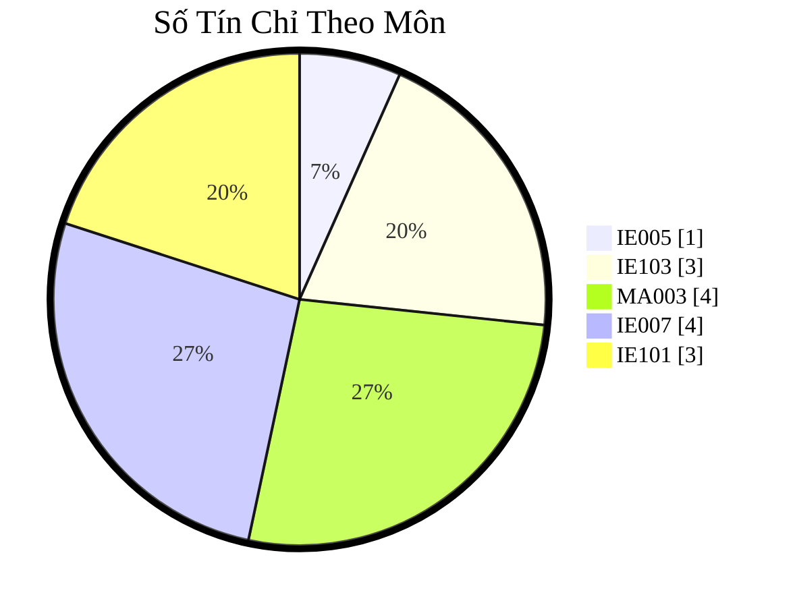

# 2025 - 2026: Học Kỳ 1 (Học Phần 1)

### Các Môn Học

- [IE005 Giới thiệu ngành Công Nghệ Thông Tin](uit/courses/IE005/IE005.md)
- [IE101 Cơ Sở Hạ Tầng Công Nghệ Thông Tin (3 TC)](uit/courses/IE101/IE101.md)
- [IE103 Quản lý thông tin](uit/courses/IE103/IE103.md)
- [IT007 Hệ Điều Hành](uit/courses/IT007/IT007.md)
- [MA003 Đại Số Tuyến Tính](uit/courses/MA003/MA003.md)

#### Các Môn Học và Tín Chỉ

- Chi tiết ở [Khung Chương Trình Đào Tạo](thongbao/khung-chuong-trinh-dao-tao.md).

| Số Thứ Tự | Mã Môn Học | Tên Môn Học                          | Số Tín Chỉ | Chương Trình Đào Tạo            | Giảng Viên                |
| --------: | ---------- | ------------------------------------ | ---------- | ------------------------------- | ------------------------- |
|         1 | `IE005`    | Giới thiệu ngành Công Nghệ Thông Tin | 1          | Giới Thiệu Ngành                | ThS. Nguyễn Thị Thùy Trâm |
|         2 | `IE101`    | Cơ sở hạ tầng Công Nghệ Thông Tin    | 3          | Kiến Thức Nền Tảng Về CNTT      | ThS. Đỗ Minh Tiến         |
|         3 | `MA003`    | Đại Số Tuyến Tính                    | 3          | Các Môn Học Đại Cương           | TS. Nguyễn Văn Hợi        |
|         4 | `IE103`    | Quản lý thông tin                    | 4          | Kiến Thức Nền Tảng Về CNTT      | ThS. Nguyễn Thành Luân    |
|         5 | `IT007`    | Hệ Điều Hành                         | 4          | Kiến Thức Về Phần Cứng Máy Tính | ThS. Trần Hoàng Lộc       |
|           |            | TỔNG SỐ TÍN CHỈ                      | 15         |                                 |                           |

#### Số Tín Chỉ Theo Môn

#### Thời Khóa Biểu

| MÃ LỚP     | `MA003.F12.LT.CNTT` | `IE005.F12.LT.CNTT` | `IE103.F12.LT.CNTT` | `IT007.F12.LT.CNTT` | `IE101.F12.LT.CNTT` |
| :--------- | :------------------ | :------------------ | :------------------ | :------------------ | :------------------ |
| SỐ TÍN CHỈ | 3                   | 1                   | 4                   | 4                   | 3                   |
| WEEKDAY    | Thứ Hai             | Thứ Ba              | Thứ Tư              | Thứ Năm             | Thứ Sáu             |
| GIỜ        | 18h15               | 18h15               | 18h15               | 18h15               | 18h15               |
| Buổi 1     | ~~2025-10-20~~      | 2025-10-21          | ~~2025-10-22~~      | 2025-10-23          | 2025-10-24          |
| Buổi 2     | 2025-10-27          | 2025-10-28          | 2025-10-29          | 2025-10-30          | 2025-10-31          |
| Buổi 3     | 2025-11-03          | 2025-11-04          | 2025-11-05          | 2025-11-06          | 2025-11-07          |
| Buổi 4     | 2025-11-10          | 2025-11-11          | 2025-11-12          | 2025-11-13          | 2025-11-14          |
| Buổi 5     | 2025-11-17          |                     | 2025-11-19          | 2025-11-20          | 2025-11-21          |
| Buổi 6     | 2025-11-24          |                     | 2025-11-26          | 2025-11-27          | 2025-11-28          |
| Buổi 7     | 2025-12-01          |                     | 2025-12-03          | 2025-12-04          | 2025-12-05          |
| Buổi 8     | 2025-12-08          |                     | 2025-12-10          | 2025-12-11          | 2025-12-12          |
| Buổi 9     | ==**TBD**==         |                     | 2025-12-17          | 2025-12-18          |                     |
| Buổi 10    |                     |                     | 2025-12-24          | 2025-12-25          |                     |

#### Thay Đổi/Chỉnh Sửa

| MÃ LỚP              | WEEKDAY    | CHANGE       | DATE       | LÝ DO             |
| :------------------ | :--------- | :----------- | :--------- | :---------------- |
| `MA003.F12.LT.CNTT` | 2025-10-20 | Hủy/đổi sang | 2025-10-27 | Thầy bận          |
| `IE103.F12.LT.CNTT` | 2025-10-22 | Hủy/đổi sang |            | Sức khỏe của thầy |
