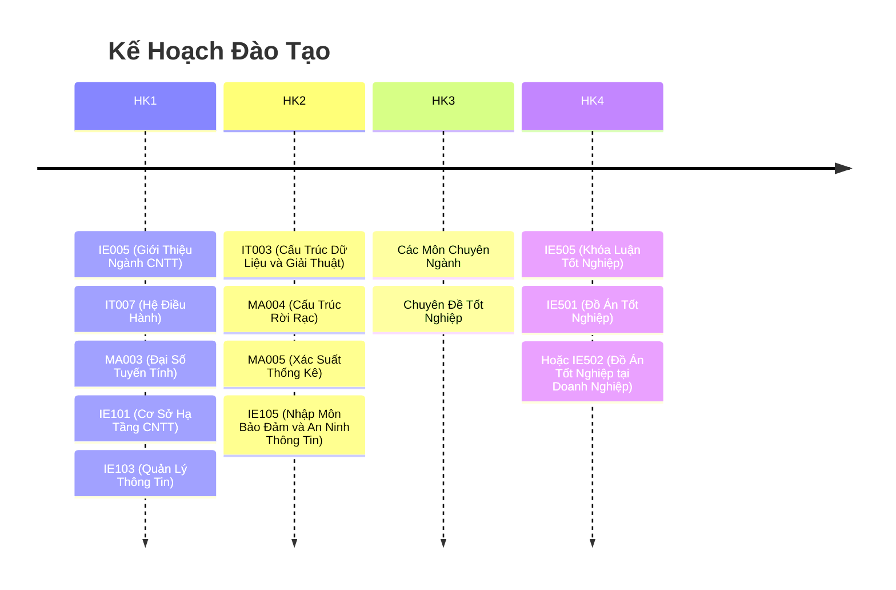

# LT.K2025.2-CNTT

- A LT.K2025.2-CNTT Repo.

Đây là một kho/vault của https://obsidian.md/.

- Clone.
- "Open folder as vault".

## Thông báo

* Truy cập các [Thông báo](thongbao/thongbao.md).

## Kế Hoạch Đào Tạo Các Kỳ

1. [2025 - 2026: Học Kỳ 1](2025-2026-HK1.md) (Bấm để xem chi tiết)
2. 2025 - 2026: Học Kỳ 2 (Chưa bổ sung)
3. 2025 - 2026: Học Kỳ 3 (Chưa bổ sung)

## NHÓM 1

* Cập nhật thông tin đầy đủ tại [Google Sheets: LT.K2025.2-GROUP-01 (chưa bổ sung)]

| STT | MSSV     | Họ Tên             | Năm Sinh | Khu Vực              | Chuyên Môn       |
| --- | -------- | ------------------ | -------- | -------------------- | ---------------- |
| 1   | 25410171 | Lê Thị Tú Anh      | 2004     | Vũng Tàu             |                  |
| 2   | 25410177 | Đoàn Phú Cần       |          |                      |                  |
| 3   | 25410179 | Giang Hải Chương   |          |                      |                  |
| 4   | 25410183 | Nguyễn Đào Anh Đạt | 2003     | Hồ Chí Minh          |                  |
| 5   | 25410193 | Nguyễn Minh Duy    | 2002     | Vũng Tàu             |                  |
| 6   | 25410204 | Trương Xuân Hậu    |          |                      |                  |
| 7   | 25410213 | Phan Chí Hiếu      | 2004     |                      |                  |
| 8   | 25410220 | Vũ Huy Hoàng       | 2000     | Vũng Tàu             |                  |
| 9   | 25410239 | Phạm Tuấn Kiệt     | 2000     | Hồ Chí Minh, Quận 12 |                  |
| 10  | 25410240 | Nguyễn Tạ Quí Lan  | 1993     | Vĩnh Long            |                  |
| 11  | 25410244 | Nguyễn Thành Lộc   | 2004     | Huế                  | dev fe           |
| 12  | 25410291 | Đinh Xuân Sâm      | 1990     |                      |                  |
| 13  | 25410319 | Đặng Hữu Toàn      | 2003     | Hà Tĩnh              |                  |
| 14  | 25410321 | Nguyễn Điền Triết  | 1996     | Hồ Chí Minh          | DEV BE (.Net,C#) |
| 15  | 25410325 | Nguyễn Văn Trung   | 2000     |                      |                  |
| 16  | 25410338 | Lê Anh Vũ          | 2001     |                      |                  |

## Chương Trình Đào Tạo Cử Nhân Liên Thông

- [Chương trình đào tạo Cử nhân Liên thông Đại học ngành Công nghệ thông tin – Hình thức đào tạo từ xa (Áp dụng từ khoá tuyển 2024)](https://www.citd.vn/chuong-trinh-dao-tao-cu-nhan-lien-thong-nganh-cong-nghe-thong-tin-hinh-thuc-dao-tao-tu-xa-ap-dung-tu-khoa-tuyen-2024/)

## Kế Hoạch Đào Tạo Tổng Quan

## Kế Hoạch Năm Học 2025 - 2026

- https://www.citd.vn/ke-hoach-nam-hoc/

