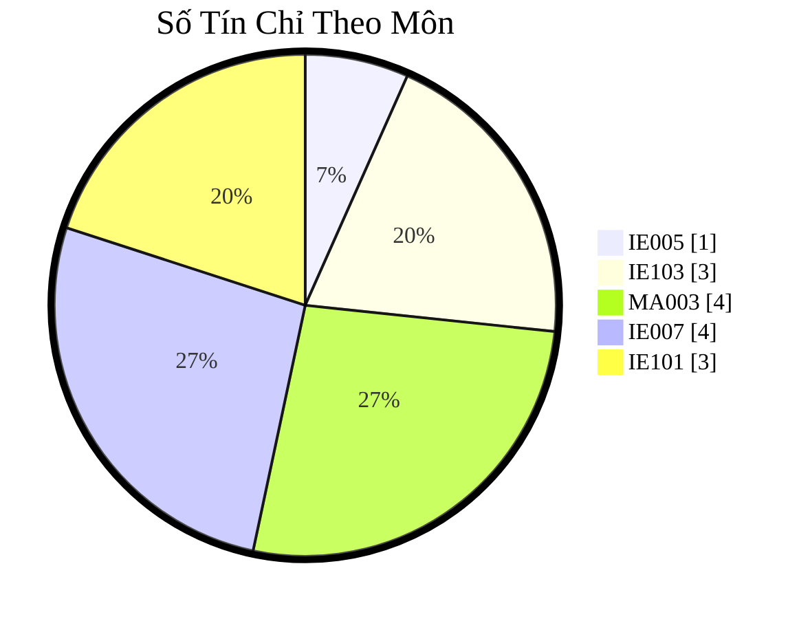

# LT.K2025.2-CNTT

- A LT.K2025.2-CNTT Repo.

Đây là một kho/vault của https://obsidian.md/.

- Clone.
- "Open folder as vault".

## Thông báo

* Truy cập các [Thông báo](thongbao/thongbao.md).

## NHÓM 1

* Cập nhật thông tin đầy đủ tại [Google Sheets: LT.K2025.2-GROUP-01 (chưa bổ sung)]

| STT | MSSV     | Họ Tên             | Năm Sinh | Khu Vực              | Chuyên Môn       |
| --- | -------- | ------------------ | -------- | -------------------- | ---------------- |
| 1   | 25410171 | Lê Thị Tú Anh      | 2004     | Vũng Tàu             |                  |
| 2   | 25410177 | Đoàn Phú Cần       |          |                      |                  |
| 3   | 25410179 | Giang Hải Chương   |          |                      |                  |
| 4   | 25410183 | Nguyễn Đào Anh Đạt | 2003     | Hồ Chí Minh          |                  |
| 5   | 25410193 | Nguyễn Minh Duy    | 2002     | Vũng Tàu             |                  |
| 6   | 25410204 | Trương Xuân Hậu    |          |                      |                  |
| 7   | 25410213 | Phan Chí Hiếu      | 2004     |                      |                  |
| 8   | 25410220 | Vũ Huy Hoàng       | 2000     | Vũng Tàu             |                  |
| 9   | 25410239 | Phạm Tuấn Kiệt     | 2000     | Hồ Chí Minh, Quận 12 |                  |
| 10  | 25410240 | Nguyễn Tạ Quí Lan  | 1993     | Vĩnh Long            |                  |
| 11  | 25410244 | Nguyễn Thành Lộc   | 2004     | Huế                  | dev fe           |
| 12  | 25410291 | Đinh Xuân Sâm      | 1990     |                      |                  |
| 13  | 25410319 | Đặng Hữu Toàn      | 2003     | Hà Tĩnh              |                  |
| 14  | 25410321 | Nguyễn Điền Triết  | 1996     | Hồ Chí Minh          | DEV BE (.Net,C#) |
| 15  | 25410325 | Nguyễn Văn Trung   | 2000     |                      |                  |
| 16  | 25410338 | Lê Anh Vũ          | 2001     |                      |                  |

## Kế Hoạch Đào Tạo

### 2025 - 2026: Học Kỳ 1

- [IE005 Giới thiệu ngành Công Nghệ Thông Tin](uit/courses/IE005/IE005.md)
- [MA003 Đại Số Tuyến Tính](uit/courses/MA003/MA003.md)
- [IE103 Quản lý thông tin](uit/courses/IE103/IE103.md)

#### Các Môn Học

| Số Thứ Tự | Mã Môn Học | Tên Môn Học                          | Số Tín Chỉ |
| --------: | ---------- | ------------------------------------ | ---------- |
|         1 | `IE005`    | Giới thiệu ngành Công Nghệ Thông Tin | 1          |
|         2 | `IE101`    | Cơ sở hạ tầng Công Nghệ Thông Tin    | 3          |
|         3 | `IE103`    | Quản lý thông tin                    | 4          |
|         4 | `MA003`    | Đại Số Tuyến Tính                    | 3          |
|         5 | `IT007`    | Hệ Điều Hành                         | 4          |
|           |            | TỔNG SỐ TÍN CHỈ                      | 15         |

#### Số Tín Chỉ Theo Môn

#### Thời Khóa Biểu

| COL 1      | COL 2          | COL 3      | COL 4      | COL 5      | COL 6      |
| :--------- | :------------- | :--------- | :--------- | :--------- | :--------- |
| STT        | 1              | 2          | 3          | 4          | 5          |
| MÃ LỚP     | MA003          | IE005      | IE103      | IT007      | IE101      |
| SỐ TÍN CHỈ | 3              | 1          | 4          | 4          | 3          |
| WEEKDAY    | Thứ Hai        | Thứ Ba     | Thứ Tư     | Thứ Năm    | Thứ Sáu    |
| GIỜ        | 18h15          | 18h15      | 18h15      | 18h15      | 18h15      |
| Buổi 1     | ~~2025-10-20~~ | 2025-10-21 | 2025-10-22 | 2025-10-23 | 2025-10-24 |
| Buổi 2     | 2025-10-27     | 2025-10-28 | 2025-10-29 | 2025-10-30 | 2025-10-31 |
| Buổi 3     | 2025-11-03     | 2025-11-04 | 2025-11-05 | 2025-11-06 | 2025-11-07 |
| Buổi 4     | 2025-11-10     | 2025-11-11 | 2025-11-12 | 2025-11-13 | 2025-11-14 |
| Buổi 5     | 2025-11-17     |            | 2025-11-19 | 2025-11-20 | 2025-11-21 |
| Buổi 6     | 2025-11-24     |            | 2025-11-26 | 2025-11-27 | 2025-11-28 |
| Buổi 7     | 2025-12-01     |            | 2025-12-03 | 2025-12-04 | 2025-12-05 |
| Buổi 8     | 2025-12-08     |            | 2025-12-10 | 2025-12-11 | 2025-12-12 |
| Buổi 9     | ==**TBD**==    |            | 2025-12-17 | 2025-12-18 |            |
| Buổi 10    |                |            | 2025-12-24 | 2025-12-25 |            |

#### Thay Đổi/Chỉnh Sửa

| MÃ LỚP            | WEEKDAY    | CHANGE       | DATE       | LÝ DO    |
| :---------------- | :--------- | :----------- | :--------- | :------- |
| MA003.F12.LT.CNTT | 2025-10-20 | Hủy/đổi sang | 2025-10-27 | Thầy bận |

### 2025 - 2026: Học Kỳ 2

(Chưa bổ sung)

### 2025 - 2026: Học Kỳ 3

(Chưa bổ sung)
