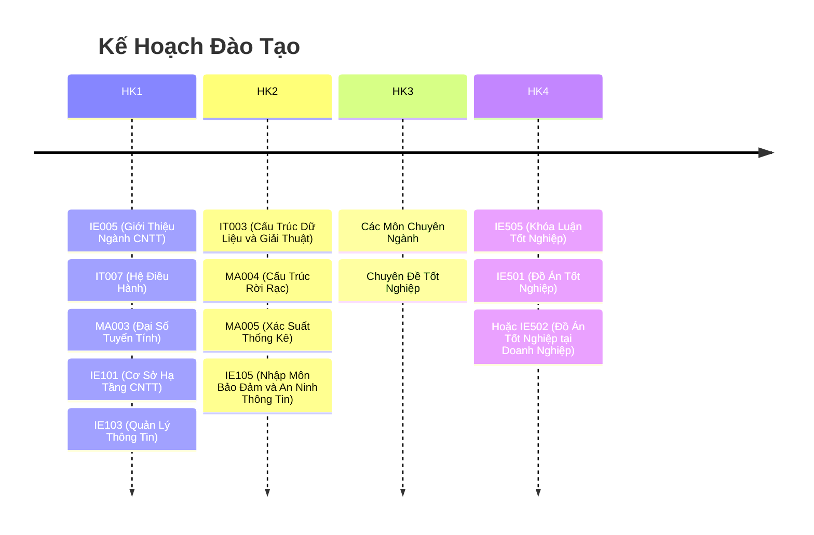

# LT.K2025.2-CNTT

- A LT.K2025.2-CNTT Repo.

Đây là một kho/vault của https://obsidian.md/.

- Clone.
- "Open folder as vault".

## Thông báo

* Truy cập các [Thông báo](thongbao/thongbao.md).

## Kế Hoạch Đào Tạo Các Kỳ

1. [2025 - 2026: Học Kỳ 1](2025-2026-HK1.md) (Bấm để xem chi tiết)
2. 2025 - 2026: Học Kỳ 2 (Chưa bổ sung)
3. 2025 - 2026: Học Kỳ 3 (Chưa bổ sung)

## Chương Trình Đào Tạo Cử Nhân Liên Thông

- [Chương trình đào tạo Cử nhân Liên thông Đại học ngành Công nghệ thông tin – Hình thức đào tạo từ xa (Áp dụng từ khoá tuyển 2024)](https://www.citd.vn/chuong-trinh-dao-tao-cu-nhan-lien-thong-nganh-cong-nghe-thong-tin-hinh-thuc-dao-tao-tu-xa-ap-dung-tu-khoa-tuyen-2024/)

## Kế Hoạch Đào Tạo Tổng Quan

## Kế Hoạch Năm Học 2025 - 2026

- https://www.citd.vn/ke-hoach-nam-hoc/

