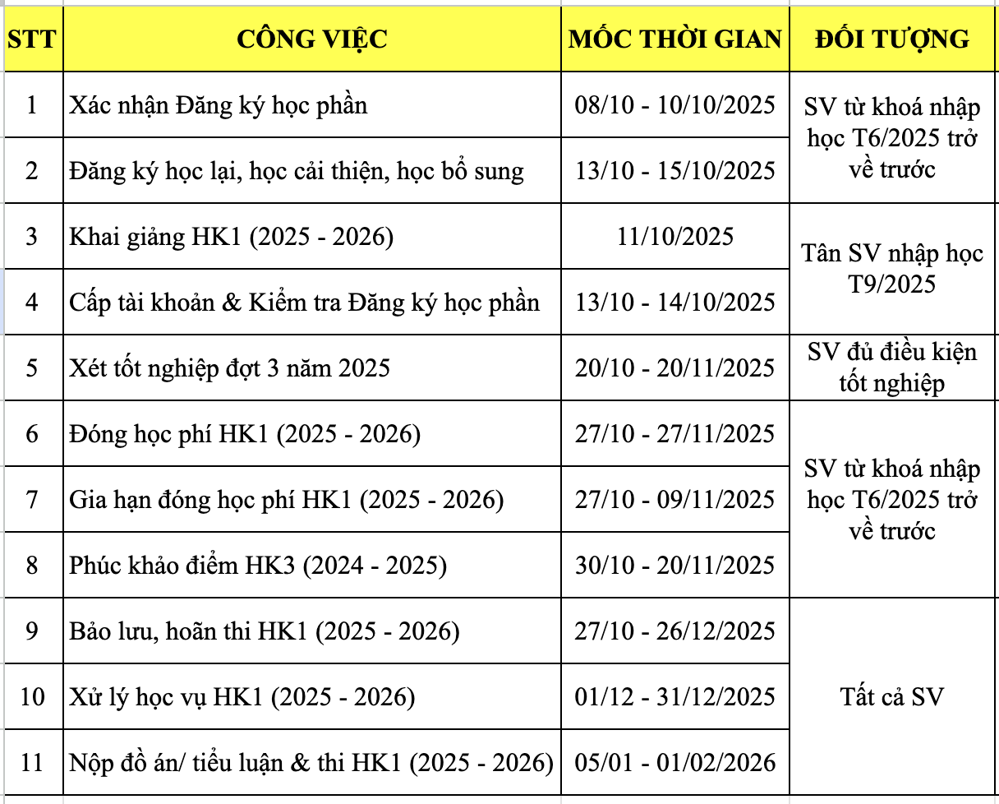

# [THÔNG BÁO] Các mốc thời gian cần lưu ý cho sinh viên hệ Đào tạo Từ xa trong HK1 (2025 – 2026)

* https://www.citd.vn/thong-bao-v-v-xac-nhan-dang-ky-hoc-phan-hk1-2025-2026-cua-sinh-vien-he-dao-tao-tu-xa/

Nhằm tạo điều kiện thuận lợi cho công tác quản lý, học tập của Sinh viên hệ Đào tạo từ xa (SV);

Thực hiện kế hoạch đào tạo năm học 2025 – 2026, Trung tâm Phát triển Công nghệ Thông tin thông báo các mốc thời gian cần lưu ý cho SV trong học kỳ 1, năm học 2025 – 2026, cụ thể như sau:

**==Điều chỉnh thời gian bắt đầu HK1 (2025 – 2026): từ ngày 20/10/2025==**

**Các mốc thời gian cần lưu ý cho sinh viên ĐTTX trong HK1 (2025 – 2026)**

Trên đây là thông báo về các mốc thời gian cần lưu ý để SV chuẩn bị tốt cho học kỳ 1, năm học 2025 – 2026. Ngoài ra, trước mỗi mốc thời gian công việc sẽ có thông báo chi tiết và hướng dẫn cụ thể để SV căn cứ thực hiện./.
