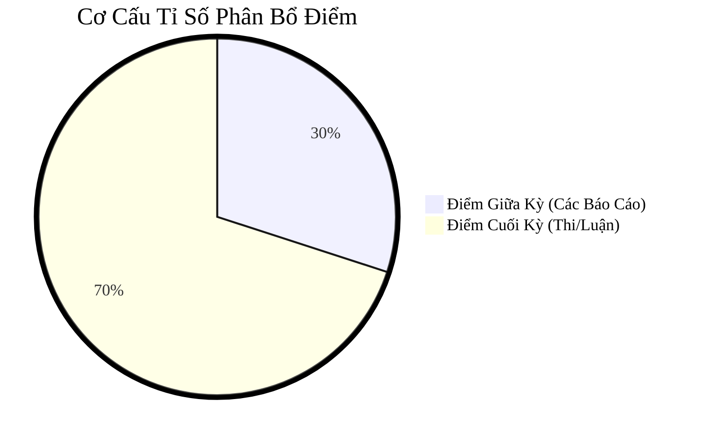

# IE005 - Giới Thiệu Nghành Công Nghệ Thông Tin

- Group Zalo Môn IE005: [https://zalo.me/g/rdvfes097](https://zalo.me/g/rdvfes097)
* [(Google Sheets) ĐĂNG KÝ NHÓM](https://docs.google.com/spreadsheets/d/1l7vLO6uBur1V_M1XRv_kjETJpmH5bEGKbCgRSGL2PRI/edit?usp=sharing)
* Group Zalo Nhóm 01: [https://zalo.me/g/hwavpi232](https://zalo.me/g/hwavpi232)

## Lưu Ý

## Cơ Cấu Tỉ Số Phân Bổ Điểm

