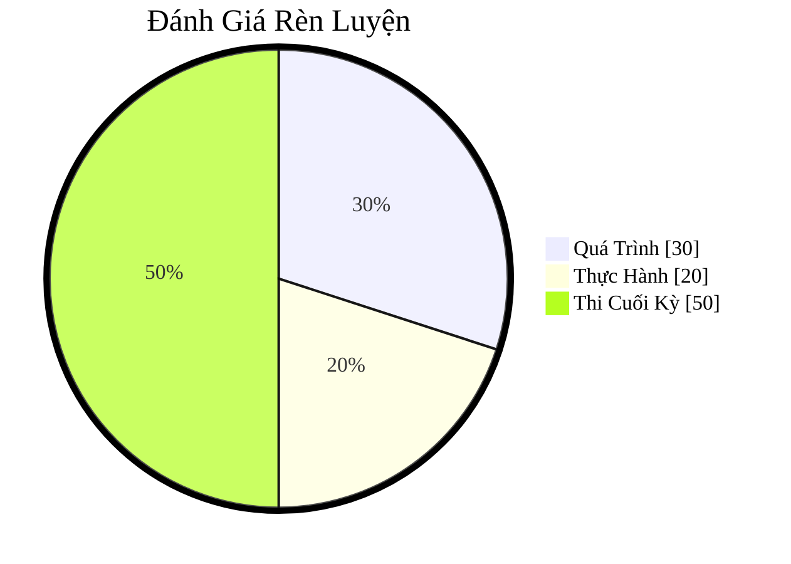

# IE101 Cơ Sở Hạ Tầng Công Nghệ Thông Tin

- [Học Kỳ 1, 2025 - 2026 ](../../../2025-2026-HK1.md)

## Syllabus

- [ĐỀ CƯƠNG MÔN HỌC IE101 – CƠ SỞ HẠ TẦNG CÔNG NGHỆ THÔNG TIN](syllabus/IE101-Information-Technology-Infrastructure.pdf)

## Textbooks

- (N/A)

## Lectures

0. [Giới thiệu môn học](lectures/ch00.pdf)
1. [Tổng quan – Các khái niệm cơ bản](lectures/ch01.pdf)
2. [Lịch sử công nghệ thông tin](lectures/ch02.pdf)
3. [Các chủ đề phổ biến trong công nghệ thông tin](lectures/ch03.pdf)
4. [Quản lý cơ sở hạ tầng công nghệ thông tin](lectures/ch04.pdf)

## Course Notes

0. [Ch00 Notes](notes/ch00.md)
1. Ch01
2. Ch02
3. Ch03
4. Ch04

## Course assessment

| Thành phần đánh giá     | CĐRMH              | Tỷ lệ (%) |
| ----------------------- | ------------------ | --------: |
| A1. Quá trình (bài tập) | G1, G2             |        30 |
| A2. Giữa kỳ             |                    |           |
| A3. Thực hành           | G1, G3             |        20 |
| A4. Đồ án cuối kỳ       | G1, G3, G4, G5, G6 |        50 |

