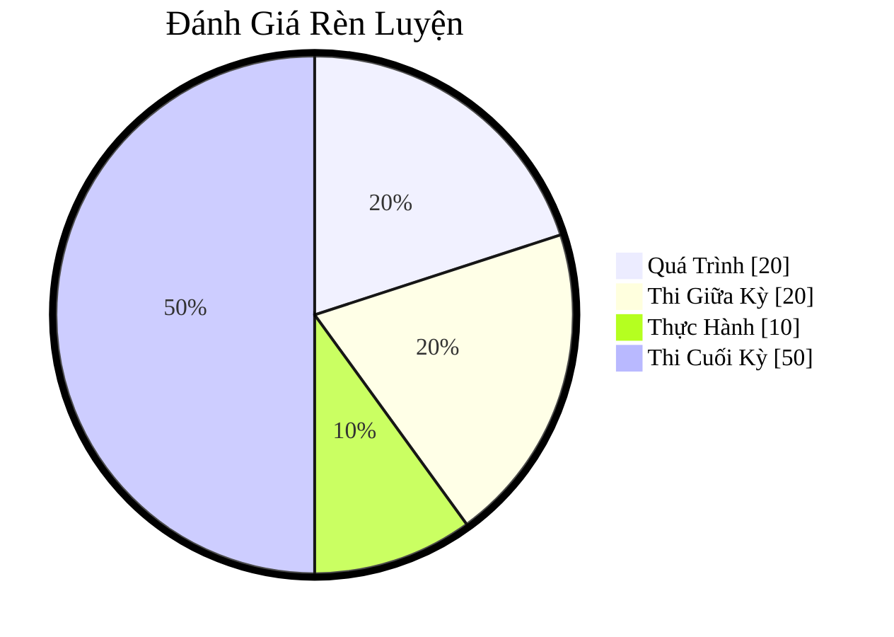

# IT007 - Operating Systems

## Moodle:

- [IT007.F12.LT.CNTT](https://elearning.citd.vn/course/view.php?id=1226#section-0)

### Chapters

1. [Chương 1. Tổng Quan về Hệ Điều Hành](elearning/ch01.md)

## Textbook

- [Silberschatz, Galvin, Gagne. Operating System Concepts, 10th edition, John Wiley & Sons, 2018](https://lib.zu.edu.pk/ebookdata/Engineering/Cyber%20Security/Operating%20System%20Concepts-Wiley%20Global%20Education%20(2018)%20BY%20Abraham%20Silberschatz_%20Greg%20Gagne_%20Peter%20B.%20Galvin%20-.pdf)
- [PDF](textbook/Operating-System-Concepts-Wiley-Global-Education.pdf)

## Đánh Giá Rèn Luyện

- Quá Trình: 20%
    - Hoàn thành bài giảng các chương trên Moodle
    - Hoàn thành các bài kiểm tra trong quá trình học
    - Điểm cộng/trừ hoạt động trên Classpoint và các lần **điểm danh bất kỳ**
- Thi Giữa Kỳ: 20%
    - Thi tập trung
    - Tự luận + Trắc nghiệm
    - Thời gian 45 phút – 60 phút
- Thực Hành: 10%
    - Hoàn thành 01 bài LAB
- **Thi Cuối Kỳ: 50%**
    - Thi tập trung
    - Tự luận + Trắc nghiệm
    - Thời gian 60 phút – 90 phút

Trực quan:

