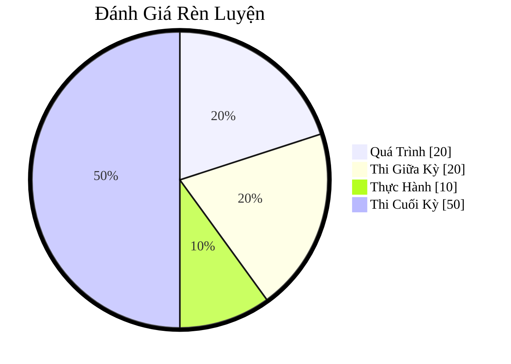

# IT007 - Operating Systems

## Moodle:

- [IT007.F12.LT.CNTT](https://elearning.citd.vn/course/view.php?id=1226#section-0)

## Textbook

- Title: Operating System Concepts
- Homepage: https://www.os-book.com/OS10/
- Book (in this vault): [Operating System Concepts PDF](textbook/Operating-System-Concepts-Wiley-Global-Education.pdf)
- Slides:
    - Pages: https://www.os-book.com/OS10/slide-dir/index.html
    - In this vault: `uit/courses/IT007/textbook/slides/`

Tips: To download all the slides in the same folder named 'PPTX-dir'.

```shell
wget -r -np -nH --cut-dirs=2 'https://www.os-book.com/OS10/slide-dir/PPTX-dir/'
```

## Đánh Giá Rèn Luyện

- Quá Trình: 20%
    - Hoàn thành bài giảng các chương trên Moodle
    - Hoàn thành các bài kiểm tra trong quá trình học
    - Điểm cộng/trừ hoạt động trên Classpoint và các lần **điểm danh bất kỳ**
- Thi Giữa Kỳ: 20%
    - Thi tập trung
    - Tự luận + Trắc nghiệm
    - Thời gian 45 phút – 60 phút
- Thực Hành: 10%
    - Hoàn thành 01 bài LAB
- **Thi Cuối Kỳ: 50%**
    - Thi tập trung
    - Tự luận + Trắc nghiệm
    - Thời gian 60 phút – 90 phút

Trực quan:



